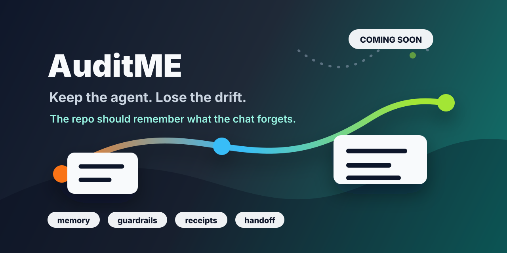

# AuditME Is Coming Soon



AuditME is a repo-native control layer for AI-assisted development.

It is being built for people who work with coding agents across real projects and need stronger continuity than chat history can provide.

## The Problem

AI agents move quickly, but long-running projects can drift:

- decisions get buried in old chats
- scope changes without a clear record
- proof becomes hard to inspect
- a new session has to rediscover the same facts
- handoffs depend on memory instead of the repo

AuditME is designed to pull that work back into the project itself.

## The Product Idea

AuditME should help a repo answer five questions:

```text
What is true?
What is approved?
What is allowed?
What proof exists?
What should happen next?
```

The first public alpha is planned around a small CLI workflow:

```bash
auditme init --project .
auditme resume --project .
auditme verify --project .
auditme handoff --project . --next-move "Describe the next safe task"
```

That is the target public path, not a release announcement.

## Current Status

AuditME is not officially released yet.

This repository is public so the product direction, docs, and visual identity can be shaped in the open before the installable alpha is launched.

The release code, package proof, final release notes, and publication path are intentionally waiting until the alpha is ready.

## What Will Not Be Published

The public release will not include:

- private CodexSystem history
- private relay notes
- generated private runtime state
- customer or work data
- secrets or credentials
- personal local machine assumptions

## Watch This Repo

Star or watch this repo if you want to follow the public alpha as it gets closer.
