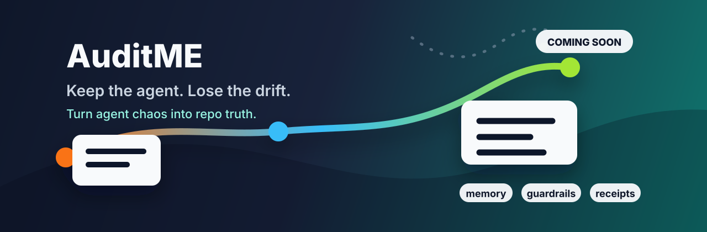

# AuditME



> **Keep the agent. Lose the drift.**

AuditME turns agent chaos into repo truth: durable project memory, scoped next moves, verification receipts, and session context that live with the code instead of disappearing into chat history.

`v0.1.0-alpha` is in final release-preflight. The public repo now has a clean Python package path plus focused `init`, `resume`, `verify`, and `handoff` behavior.

`public alpha prep` | `CLI-first` | `repo-local memory` | `honest verification`

## Why It Exists

AI coding agents are powerful, but long-running projects drift. A fresh session forgets decisions, scopes creep, proof gets fuzzy, and the repo starts depending on whatever the last chat remembered.

Without AuditME, project memory gets trapped in chat instead of living with the repo.

AuditME gives that work a control layer: a small, repo-local operating surface that tells agents what is true, what is allowed, what proof exists, and what should happen next.

## Without AuditME / With AuditME

| Without AuditME | With AuditME |
| --- | --- |
| Context is scattered across chats. | Project memory lives in repo-local files. |
| New sessions rediscover the same facts. | `auditme resume` gives a copyable starting point. |
| "Done" can mean "the agent sounded confident." | `auditme verify` separates proof, warnings, and failures. |
| Scope depends on prompt discipline. | Guardrails and task context travel with the project. |
| Handoffs are fragile. | The next move is meant to be recorded before the session ends. |

## Command Path

The public alpha is intentionally small:

```bash
auditme init --project .
auditme resume --project .
auditme verify --project .
auditme handoff --project . --next-move "Describe the next safe task"
```

Implemented now:

- `auditme init --project .`
- `auditme resume --project .`
- `auditme verify --project .`
- `auditme handoff --project . --next-move "..."`

Still pending:

- final alpha release checklist
- release tag and publication decision

## What It Is

AuditME is:

- a repo-native memory and verification layer for AI-assisted development
- a CLI-first workflow for serious builders and small teams
- a way to make agent handoffs, task scope, decisions, and proof easier to inspect
- a public-safe package being prepared for `v0.1.0-alpha`

## What It Is Not

AuditME is not:

- a replacement for a coding agent
- a guarantee that generated code is correct
- a cloud sync system
- a desktop dashboard in the first alpha
- a place to store secrets, customer data, private relay notes, or personal machine paths

## First 5 Minutes

A new repo should be able to start with:

```bash
auditme init --project .
auditme resume --project .
auditme verify --project .
auditme handoff --project . --next-move "Describe the next safe task"
```

`init` creates a small public-safe `90_AUDITME/` folder in the target project. `resume` prints useful context for the next agent. `verify` reports honest status: `pass` when proof exists, `warn` when proof is missing or weak, and failure for broken required state. `handoff` records the next safe move in repo-local state.

In the first public alpha, `warn` is advisory and can exit successfully. Treat it as "not ready to claim done," not as a broken install.

## Current Status

This repository is not the official release yet. It is the clean public release-preflight repo.

Current state:

- Public repo scaffold is live.
- Python package skeleton is merged.
- `auditme --help` works.
- `auditme init`, `auditme resume`, `auditme verify`, and `auditme handoff` are implemented in focused slices.
- Package build path is in place.
- Private CodexSystem engine code and generated private runtime state are not imported.
- MIT license is in place.

## Who It Is For

AuditME is for builders using AI coding agents across real projects: solo operators, small teams, product builders, and engineers who want agents to move fast without losing the thread.

It is especially useful when the cost of drift is high: production apps, customer-facing tools, internal business systems, long-running branches, or repos touched by more than one agent.

## Release Principles

AuditME should be:

- easy to install
- safe by default
- path-neutral
- honest about verification status
- clear for humans and agents
- useful without private workflow knowledge
- strong enough for serious projects, but small enough to understand quickly

## Docs

Start here:

- [First 5 Minutes](docs/FIRST_5_MINUTES.md)
- [Adopter Guide](docs/ADOPTER_GUIDE.md)
- [Release Preflight](docs/RELEASE_PREFLIGHT.md)
- [Smoke Test Plan](docs/SMOKE_TEST_PLAN.md)

Release and implementation planning:

- [Architecture Direction](docs/ARCHITECTURE.md)
- [Roadmap](docs/ROADMAP.md)
- [Code Publication Plan](docs/CODE_PUBLICATION_PLAN.md)
- [Package And Install Plan](docs/PACKAGE_INSTALL_PLAN.md)
- [Public Import Map](docs/IMPORT_MAP.md)
- [Brand Direction](docs/BRAND_DIRECTION.md)

## License

AuditME is released under the [MIT License](LICENSE).
