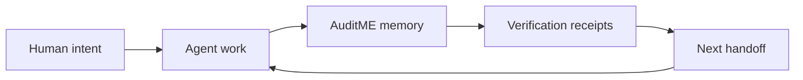

# AuditME First 5 Minutes

> Status: coming-soon guide. AuditME is not officially released yet; this page describes the intended first alpha experience.

This is the plain-English path for a first-time user.

AuditME is not here to make AI coding fancy. It is here to make AI coding harder to lie about.

The first public alpha should answer five questions for a repo:

```text
What is this project?
What is the agent allowed to touch?
What is the next approved task?
What proof exists?
What should the next session do?
```

## The Short Version

You add AuditME to a repo, let it create a small repo-local memory folder, then use that folder to keep AI sessions grounded.

Target first run after public release:

```bash
auditme init --project .
auditme resume --project .
auditme verify --project .
auditme handoff --project . --next-move "Describe the next safe task"
```

If that feels too simple, good. The alpha should be boring on purpose.

## What `auditme init` Should Do

Planned command:

```bash
auditme init --project .
```

Expected result:

```text
90_AUDITME/
  AUDITME_RESUME.md
  AUDITME_TASK_QUEUE.md
  AUDITME_DECISION_LEDGER.md
  AUDITME_VERIFICATION_RECEIPTS.md
  auditme.config.json
```

These are fresh public-safe artifacts created in the target repo, never copied from private history or runtime state.

AuditME should create predictable files in one predictable folder. It should not scan your life, phone a private workflow, or silently rewrite unrelated project files.

## What `auditme resume` Should Do

Planned command:

```bash
auditme resume --project .
```

Expected result:

- a short project summary
- the current branch or lane when known
- the next approved task
- allowed write scope
- stop conditions
- recent verification state
- a clear error if AuditME has not been initialized yet

This is the text you give to a fresh coding agent so it starts with repo truth instead of guessing from chat crumbs.

## What `auditme verify` Should Do

Planned command:

```bash
auditme verify --project .
```

Expected result:

- `pass` for checks with proof
- `warn` for missing or weak proof
- `fail` for broken required checks
- clear next action

In the public alpha, `warn` should be intentionally non-blocking and exit successfully. Broken required state, invalid config, or a missing project path should exit with an error.

AuditME should never turn "I feel like it worked" into a green checkmark.

## What `auditme handoff` Should Do

Planned command:

```bash
auditme handoff --project . --next-move "Add tests for the init command"
```

Expected result:

- update the repo-local handoff state
- preserve the next safe move
- avoid relying on chat history as the only memory

## The Mental Model



Without AuditME, the next session often starts with "remind me what we were doing." With AuditME, the repo should already know.

## What Not To Put In AuditME

Do not store:

- secrets
- credentials
- customer data
- private generated state from another repo
- personal machine paths as required behavior
- giant chat transcripts
- unchecked claims that work is done

AuditME memory is repo-local operating context, not a diary and not a vault.

## Alpha Success Standard

`v0.1.0-alpha` is ready only when a stranger can clone the public repo, install AuditME, run the four core commands in a fresh test repo, and understand what happened without knowing anything about the private project where AuditME was born.
